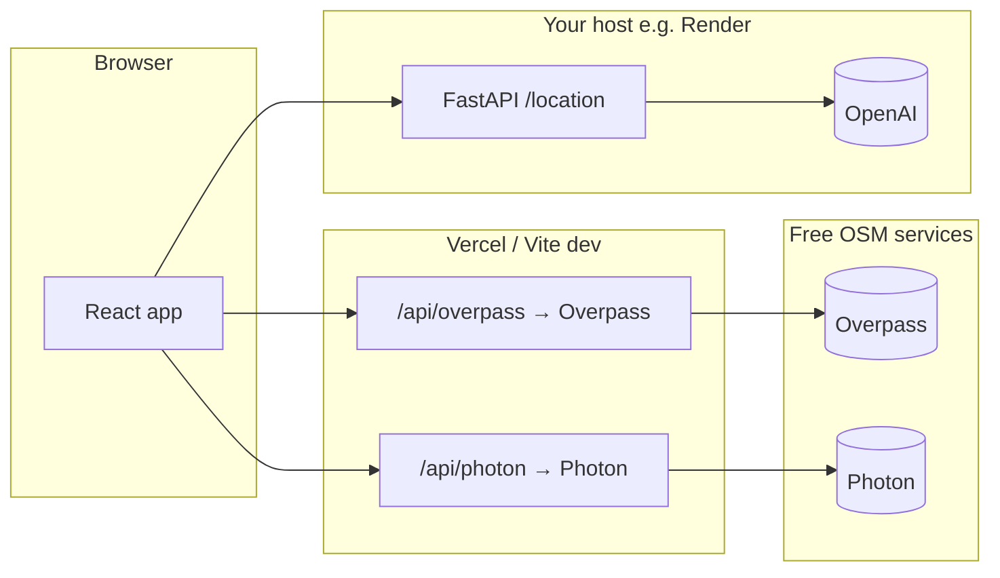

<div align="center">

# Your Tour Guide

**Explore the world on a dark map.** Tourist places come from **OpenStreetMap**; tap a pin and your **FastAPI + OpenAI** backend returns structured travel-style details.

[](https://react.dev/)
[](https://www.typescriptlang.org/)
[](https://vitejs.dev/)
[](https://www.python.org/)
[](https://fastapi.tiangolo.com/)
[](https://leafletjs.com/)

</div>


</div>

## At a glance

| | |
|:---|:---|
| **Map** | React Leaflet, **CARTO Dark Matter** basemap (OSM). |
| **Pins** | Loaded live from **Overpass API** (tourism tags in the current view). |
| **Search** | **Photon** geocoder — place names & addresses; map flies to results (top-right panel). |
| **You** | Optional **browser geolocation** for the initial center (HTTPS / localhost). |
| **Details** | Click a marker → **`GET /location`** with `name`, `latitude`, `longitude` — each coordinate is sent as **8 decimal places** (WGS84) for a stable, high-precision pin → OpenAI-structured JSON. |

---

## Feature highlights

```
┌─────────────────────────────────────────────────────────────────┐
  OSM data     ·  Debounced + cancellable Overpass requests
  Geocode      ·  Same-origin proxy (Vite + Vercel) → no CORS pain
  Resilience   ·  Bbox limits, retries & backoff on 429 / 504
  UX           ·  Hover tooltips on pins; multi-result search list
└─────────────────────────────────────────────────────────────────┘
```

---

## How it works



---

## Repository layout

| Path | Role |
|------|------|
| `Backend/main.py` | FastAPI app, `GET /location` |
| `Frontend/src/App.tsx` | Map, markers, geolocation, Overpass layer |
| `Frontend/src/overpass.ts` | Overpass query, bbox checks, retries |
| `Frontend/src/geocode.ts` + `MapSearch.tsx` | Photon geocoding + search UI |
| `Frontend/vite.config.ts` | Dev proxies: `/api` → FastAPI, `/api/overpass`, `/api/photon` |
| `Frontend/vercel.json` · root `vercel.json` | Vercel install + rewrites for Overpass & Photon |
| `requirements.txt` | Python dependencies |

```
Tourism_Map_Info_Search/
├── Backend/
│   └── main.py
├── Frontend/
│   ├── src/
│   │   ├── App.tsx
│   │   ├── MapSearch.tsx
│   │   ├── geocode.ts
│   │   ├── overpass.ts
│   │   └── …
│   ├── vite.config.ts
│   ├── vercel.json
│   └── package.json
├── requirements.txt
├── vercel.json
├── .vercelignore
└── README.md
```

---

## Prerequisites

- **Python** 3.11+ (3.10+ usually works)
- **Node.js** 18+ and npm
- **OpenAI API key** (backend uses e.g. `gpt-4o-mini` in `Backend/main.py`)

---

## Environment variables

### Backend — root `.env` (local)

| Variable | Required | Description |
|----------|:--------:|-------------|
| `OPENAI_API_KEY` | Yes | OpenAI API key |
| `CORS_ORIGINS` | Yes* | Comma-separated origins, no trailing slashes. Example: `http://localhost:5173,http://127.0.0.1:5173` |

\*If empty, browsers are blocked by CORS.

| Optional | Description |
|----------|-------------|
| `CORS_ORIGIN_REGEX` | e.g. `https://.*\.vercel\.app` for all `*.vercel.app` previews |

### Render (or any API host)

Same variables as above. Include every **real browser origin** (your Vercel URL, localhost if you test against prod).

### Vercel (frontend build)

`VITE_*` are baked in at **build time** — **redeploy** after changes.

| Variable | Description |
|----------|-------------|
| `VITE_API_BASE_URL` | Public API URL **without** trailing slash, e.g. `https://your-service.onrender.com`. If unset, the app uses `/api/...` (Vite proxy in dev only). |

| Optional | Description |
|----------|-------------|
| `VITE_OVERPASS_PROXY_PATH` | Override Overpass proxy path (default `/api/overpass`). |
| `VITE_PHOTON_PROXY_PATH` | Override Photon proxy path (default `/api/photon`). |

> **CORS:** The browser’s `Origin` must match `CORS_ORIGINS` or `CORS_ORIGIN_REGEX` on the API.

---

## Local setup

### 1. Clone and `.env`

```env
OPENAI_API_KEY=sk-...
CORS_ORIGINS=http://localhost:5173,http://127.0.0.1:5173
```

### 2. Backend (repo root)

```bash
python -m venv .venv
```

**Windows (PowerShell):** `.\.venv\Scripts\Activate.ps1`

```bash
pip install -r requirements.txt
python -m uvicorn Backend.main:app --reload --host 127.0.0.1 --port 8000
```

- Swagger: [http://127.0.0.1:8000/docs](http://127.0.0.1:8000/docs)
- Example: `GET /location?name=Eiffel%20Tower&latitude=48.85837000&longitude=2.29448000` (client uses **8** fractional digits for `latitude` / `longitude`)

### 3. Frontend

```bash
cd Frontend
npm install
npm run dev
```

Open [http://localhost:5173](http://localhost:5173).

**Dev proxies** (`Frontend/vite.config.ts`):

| Prefix | Target |
|--------|--------|
| `/api/overpass` | Overpass interpreter |
| `/api/photon` | Photon Komoot API |
| `/api` (other) | `http://127.0.0.1:8000` (FastAPI paths without `/api` prefix) |

### Production build (smoke test)

```bash
cd Frontend
npm run build
npm run preview
```

Output: `Frontend/dist/`.

---

## Deploying with GitHub

### API on Render

1. **Web Service** → connect repo.
2. **Root directory:** empty (repo root has `requirements.txt`).
3. **Build:** `pip install -r requirements.txt`
4. **Start:** `uvicorn Backend.main:app --host 0.0.0.0 --port $PORT`
5. Env: `OPENAI_API_KEY`, `CORS_ORIGINS`, optional `CORS_ORIGIN_REGEX`.

Free tier may **sleep**; first request after idle can be slow.

### Frontend on Vercel

Pick **one** root strategy and match the dashboard:

| Vercel root | Config |
|-------------|--------|
| **Empty** (repo root) | Root `vercel.json`: build `Frontend/`, output `Frontend/dist`, rewrites for Overpass + Photon |
| **`Frontend`** | `Frontend/vercel.json` |

1. Import repo, set **Root Directory** as above.
2. Set **`VITE_API_BASE_URL`** for Production (and Preview if needed).
3. Deploy.

`.vercelignore` keeps uploads lean (`Backend/`, `.venv`, etc.).

---

## Map & geodata (frontend)

| Source | Role |
|--------|------|
| **CARTO Dark Matter** | Basemap (OSM). |
| **Overpass** (`overpass-api.de` via `/api/overpass`) | Tourism POIs in view (`attraction`, `museum`, `gallery`, `viewpoint`, `theme_park`, `zoo`). |
| **Photon** (`photon.komoot.io` via `/api/photon`) | Forward geocoding for the search box. |

**Behavior notes**

- Fetches run from zoom **≥ 11** and only if the viewport bbox is under configured degree limits (reduces timeouts and rate limits).
- Requests are **debounced**, **aborted** on move, and use **retries with backoff** on 429 / 504 (and related statuses).
- **Geolocation** uses the browser API; after you **search**, GPS is ignored so a late fix does not jump the map away from your result.

Attribution strings are shown on the map.

---

## Troubleshooting

| Symptom | Likely cause | Fix |
|---------|--------------|-----|
| **Failed to fetch** (deployed) | Missing `VITE_API_BASE_URL` or CORS | Set env on Vercel, redeploy; fix `CORS_*` on API host. |
| **No pins / Overpass errors** | Rate limits, huge area, or proxy | Zoom in; wait; check `/api/overpass` rewrite in Vercel. |
| **Search never loads** | Photon proxy / network | Check `/api/photon` rewrite; try another network. |
| **ENOENT package.json** | Wrong folder | Run npm from **`Frontend/`**. |
| **Uvicorn launcher error** after moving repo | Stale venv | Recreate `.venv` or use `python -m uvicorn …`. |
| API OK in Swagger, fails in browser | CORS | Origin must match **exactly** (scheme, host, port). |

---

## API reference

### `GET /location`

| Query | Required | Description |
|-------|:--------:|-------------|
| `name` | Yes | Place label (e.g. OSM name). |
| `latitude` | Yes | WGS84 latitude of the map marker (`-90` … `90`). The **frontend** sends this with **8 digits** after the decimal point (`toFixed(8)`). |
| `longitude` | Yes | WGS84 longitude of the map marker (`-180` … `180`). Same **8** fractional digits as `latitude`. |

The backend forwards **name + high-precision coordinates** to the model: the user message formats latitude and longitude with **8 fractional digits** (Python `.8f`). The system prompt states that these **8 decimal-degree** WGS84 values must be treated as authoritative (no mental rounding), so homonymous places worldwide are disambiguated by the **exact** pin position.

**200** — `summary`, `tourist_rating`, `location_address`, `location_phone`, `parking_availability`, `parking_address` (see `TouristLocationResponse` in `Backend/main.py`).

**500** — `OPENAI_API_KEY` missing. **502** — model / invalid JSON.

---

## Branches & version tags

Numbered release-style branches use **underscores** (e.g. `Version_2`) because Git branch names **cannot contain spaces**.

| Name | Meaning |
|------|---------|
| **`main`** | Default integration branch; production-oriented history |
| **`development`** | Day-to-day feature work; periodically merged with `main` so both stay aligned |
| **`Version_1`** | Snapshot branch created from `main` at the Version 1 milestone (see GitHub) |
| **`Version_2`** | Snapshot branch from `main` at the Version 2 milestone (OSM/Overpass + Photon search, header logo, **`GET /location`** with WGS84 coords for the LLM, **Your Tour Guide**, MIT `LICENSE`) |
| **Git tag `v1.0.0`** | **Restore Point 1** — older snapshot of the tracked tree at that tag |
| **Git tag `v2.0.0`** | **Restore Point 2** — operational fallback; exact tracked files at commit `b734cd5` (use if later work breaks production) |

**Examples**

- Inspect **tag** `v1.0.0` (detached): `git fetch --tags && git switch --detach v1.0.0`
- Inspect **Restore Point 2** (`v2.0.0`, detached): `git fetch --tags && git switch --detach v2.0.0`
- Check out **branch** `Version_2`: `git fetch origin && git switch Version_2`

### Restore Point 2 (`v2.0.0`)

Restore Point 2 is the **annotated Git tag `v2.0.0`**. It points to commit **`b734cd5`** and records the **exact content of every tracked file** in the repository at that moment. If future development causes an operational issue, returning to this tag restores the project directory (as committed in Git) to that known-good state.

**Not included in any tag:** ignored paths such as `.env`, `node_modules/`, virtualenvs, and build output are **not** in Git—re-create or restore those separately (e.g. from your own backups or env docs above).

| Goal | Commands |
|------|----------|
| **Look around** (read-only, detached HEAD) | `git fetch --tags` then `git switch --detach v2.0.0` |
| **Move local `main` back** to Restore Point 2 (drops commits that came after `v2.0.0` on `main` until you merge or cherry-pick again) | `git switch main` → `git fetch origin` → `git reset --hard v2.0.0` |
| **Branch from Restore Point 2** to fix forward without rewriting `main` yet | `git fetch --tags` → `git switch -c fix-from-restore-point-2 v2.0.0` |

Updating the **remote** default branch to match this tag (e.g. force-moving `origin/main`) rewrites shared history—only do that with team agreement, using e.g. `git push --force-with-lease origin main` after a local `main` reset to `v2.0.0`.

**Restore Point 1** remains available as tag **`v1.0.0`** (same detached / `git reset --hard v1.0.0` pattern).

---

## License

This project is released under the **MIT License**. See the [`LICENSE`](LICENSE) file in the repository root for the full text.
